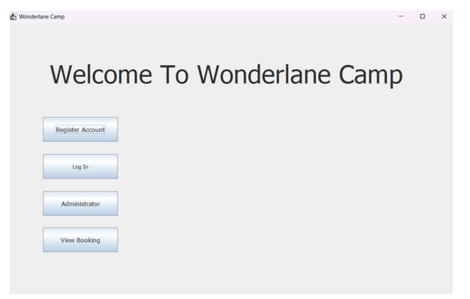
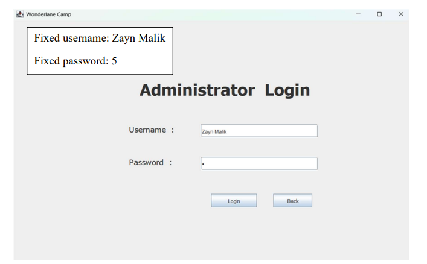
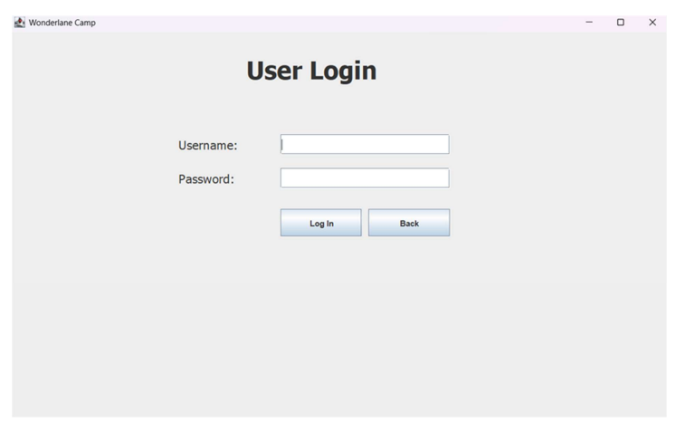
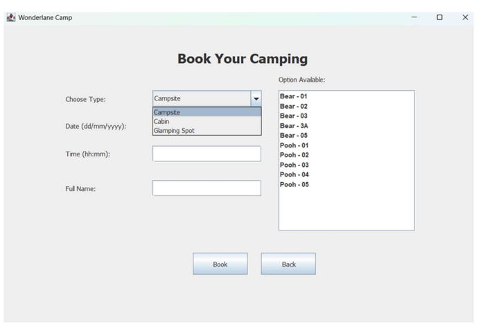
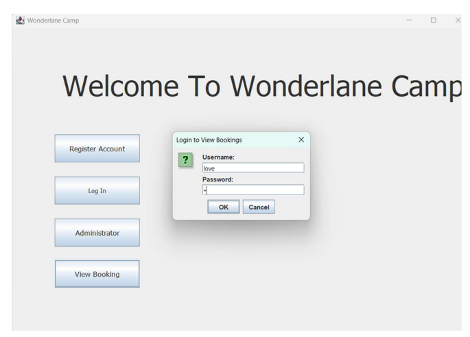
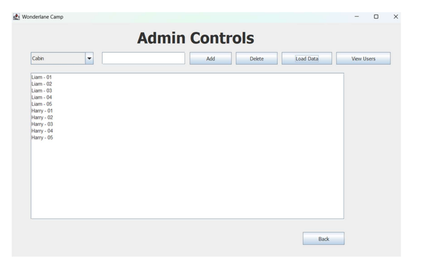
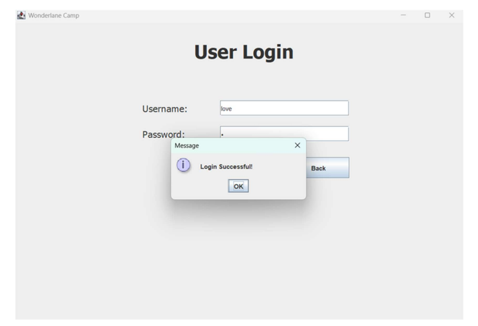

# Camping_Reservation_System - "wonderland Camping site" 
This Java (programming language) GUI camping system provides easy access for administrators, employees, and customers, with an interface designed following Shneiderman's Eight Golden Rules.

## Technologies Used
- Java
- Java Swing
- Text File Handling
  
## Features
- Login Panel
- Registeration_NewUser
- User_information_1
- User_inforation_2
- Camping_reservation_system (Home Page)
- Admin_site_1
- Admin_site_2

## How to Run
1. Clone or download this repository.
2. Open the project in your Java IDE (NetBeans, IntelliJ IDEA, or Eclipse).
3. Run the main Java file to start the application.

## Authors
- ssyuri @ abigiel.c

## Screenshots

